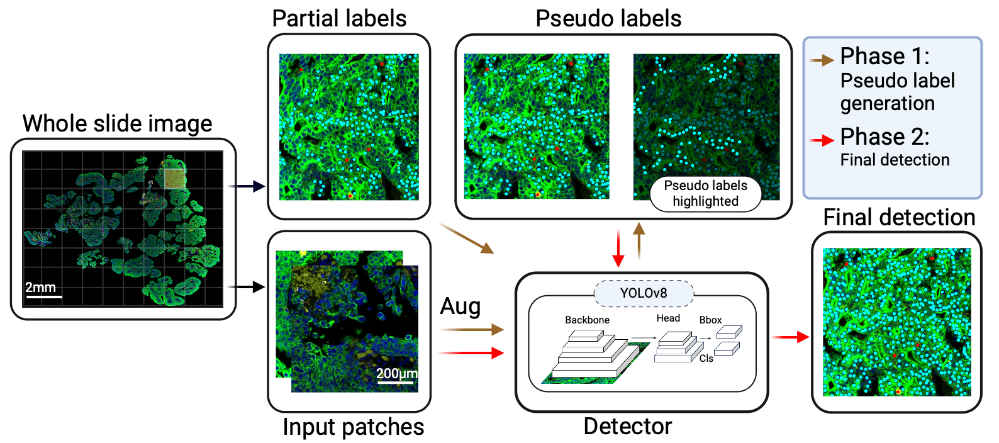

# Advanced mIF Cell Detection with Semi-Supervised Learning

## Overview
This project introduces an innovative approach for enhancing cell detection in multiplex immunofluorescence (mIF) imaging through semi-supervised learning and pseudo-labeling, utilizing models like YOLOv8s for superior accuracy and efficiency.

## Project Structure
- **manuscript/**: Contains detailed documentation of the research, including study design, methodologies, results, and conclusions. This section is crucial for anyone looking to understand the theoretical background or replicate the study.
- **.DS_Store**: System file created by macOS to store custom attributes of a folder.
- **.gitattributes**: Controls Git's handling of file attributes, useful for defining how diffs and merges should be performed for specific files.
- **LICENSE**: Specifies the MIT License under which this project is distributed, outlining permissions for use, distribution, modification, etc.
- **README.md**: Provides an overview of the project, installation instructions, usage guide, and additional information for users and contributors.
- **annotations_preprocessing.ipynb**: Jupyter notebook for preprocessing annotation data, preparing it for model training.
- **faster_rcnn.ipynb**: Notebook demonstrating the application of the Faster R-CNN model within this project's context.
- **patches_extractions.ipynb**: Extracts image patches from larger scans, a critical step for processing and analyzing mIF images.
- **predictions_final_model.ipynb**: Generates predictions using the trained model, showcasing the effectiveness of the semi-supervised learning approach.
- **yolo_to_coco_fasterrcnn.ipynb**: Converts YOLO annotations to the COCO format, facilitating compatibility with Faster R-CNN.
- **yolov5.ipynb**, **yolov8s.ipynb**: Notebooks detailing the implementation and tuning of YOLOv5 and YOLOv8s models for cell detection, highlighting model-specific adjustments and optimizations.

## Figures

### Figure 1


### Figure 2


### Figure 3


### Figure 4


# Advanced Multiplex Immunofluorescence Cell Detection using Semi-Supervised Learning

## Overview
This project develops a novel approach for cell detection in multiplex immunofluorescence (mIF) imaging, leveraging semi-supervised learning with pseudo-labeling to address the challenge of limited and unevenly distributed annotations. The method significantly enhances the accuracy and comprehensiveness of cell detection across different cancer types, employing YOLOv8s for its superior performance.

## Manuscript Highlights
- **Title**: Advancing Multiplex Immunofluorescence Imaging Cell Detection using Semi-Supervised Learning with Pseudo-Labeling
- **Authors**: Yasin Shokrollahi et al.
- **Institution**: The University of Texas MD Anderson Cancer Center
- **Abstract**: The paper presents a streamlined semi-supervised approach that effectively utilizes partially pathologist-annotated single-cell data in multiplexed images, achieving remarkable precision, recall, and F1 scores across various cancer types.

## Figures Explanation
- **Figure 1**: Demonstrates the process of generating pseudo-labels and employing a semi-supervised learning approach for cell detection. This includes immune cells (CD45+), epithelial and cancer cells (panCK+), and others (CD45-panCK-), highlighting the methodology's ability to enrich the dataset with high-quality pseudo labels.
  
  

- **Figure 2**: Showcases the pre-processing and annotation strategy, illustrating the patch extraction method and the dataset's augmentation to enhance model training and performance validation across different cancer types.

  

- **Figure 3**: Provides a comparison of cell counts between pathologist annotations and YOLOv8s predictions, validating the model's accuracy in detecting various cell types.

  

- **Figure 4**: Compares the average number of annotations for CD45, panCK, and Others between pathologists and YOLOv8s across five distinct cancer types, showcasing the algorithm's consistency and reliability in annotation.

  

## Installation
```bash
git clone https://github.com/idso-fa1-pathology/semi-supervised-cell-detection.git
cd semi-supervised-cell-detection
pip install -r requirements.txt


